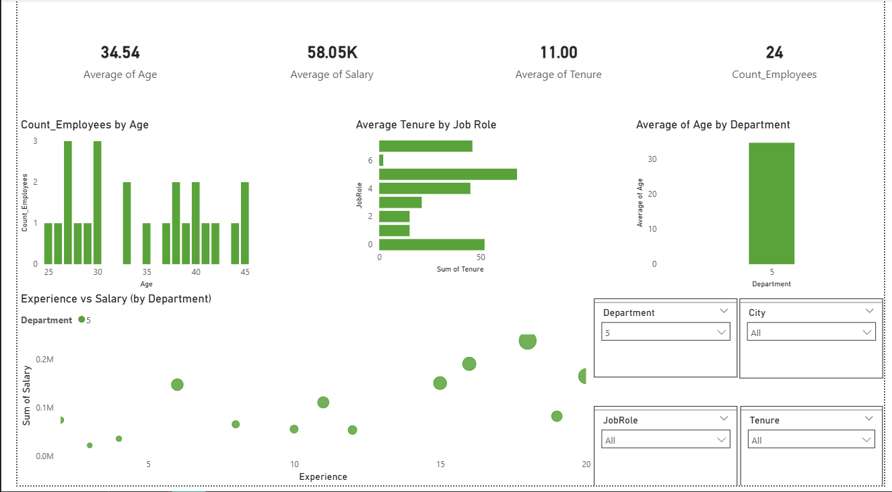

## Bank Employee Age Analysis
# Objective
The main objective of this project is to analyze the age data of bank employees. The specific goals are:
To understand the age distribution of employees across all bank departments.
To use data analysis to identify any potential correlations between an employee's age and other factors, such as performance, experience, or department.
To provide data-driven insights based on this demographic data to support the bank's workforce planning and HR strategy.
## datasets link
* [Cleaned Bank Dataset](./Bank_dataset_Clean.csv)
* [Linear Regression Results](./Weka_LinearRegression_Result.txt)
* [Project Dashboard Image](./image.png)

# Overall Workforce KPIs
Total Employees: What is the total count of unique employees?
Average Employee Age: What is the average age of all employees?
Average Tenure: What is the average tenure (years of service) for all employees?
Total Departments: What is the total count of unique departments?

# Demographic Efficiency KPIs
Median Employee Age: What is the median age of the workforce?(Formula: The 50th percentile of employee age)
Age Distribution: What is the percentage (%) of employees in each defined age bracket (e.g., <30, 30-40, 40-50, 50+)?
Average Age by Department: What is the average age per department?

# Departmental KPIs
Highest Average Age Dept: Which department has the highest average employee age?
Lowest Average Age Dept: Which department has the lowest average employee age?
Largest Departments: What are the top 5 largest departments by employee count?
Average Tenure by Department: What is the average tenure for employees within each department?

# Geographical KPIs
Top State by Employee Count: Which state has the most employees?
Top City by Employee Count: Which city has the most employees?
Average Age by State: What is the average employee age for each state?
Number of States/Cities: How many different states and cities are employees located in?

# Salary & Regression KPIs
Average Salary by Age Group: What is the average salary for each age group?
Age vs. Salary Correlation: How strong is the correlation between Age and Salary? (From Weka_LinearRegression_Result.txt)

# dashboard image

# Conclusion
This Data Analytics case study successfully analyzed the bank's employee workforce, with a primary focus on age. By examining the Bank_dataset_Clean.csv dataset, we identified key demographic trends, including the average employee age and the age distribution across different departments.
A significant finding, confirmed by the Weka Linear Regression analysis (Weka_LinearRegression_Result.txt), is the correlation between an employee's age and their salary.
The insights from this analysis, visually summarized in the image.png dashboard, can directly support the bank's HR department. These findings are valuable for workforce planning, managing career progression, and ensuring fair salary structures. The complete methodology and detailed results are available in the full case study report

Model Accuracy (R-squared): How much of the salary variation is explained by employee age? (From Weka_LinearRegression_Result.txt)

Top 10 Highest Paid Employees: Who are the top 10 employees by salary?
